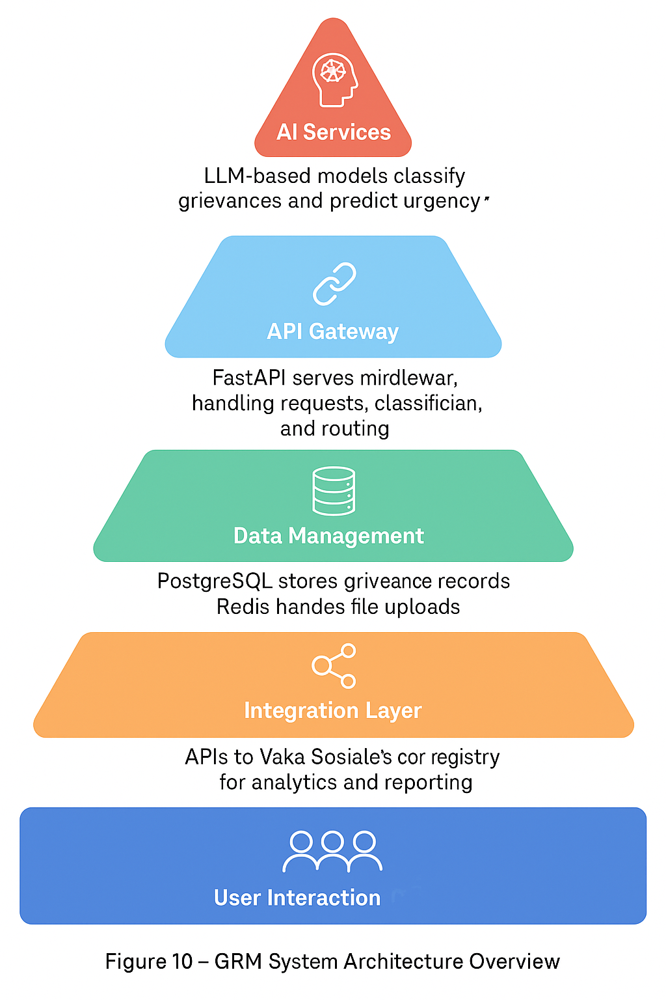

<div align="center">

#  Grievance Management System

### _Modern, scalable grievance tracking for Vaka Sosiale_

<br>

[](https://fastapi.tiangolo.com)
[](https://www.python.org)
[](https://www.postgresql.org)
[](https://www.docker.com)
[](backend/tests/)

<br>



<br>

**Capture grievances via Typebot**  **Process through FastAPI**  **Store in PostgreSQL/MinIO**

<br>

[Quick Start](#-quick-start)  [Architecture](#-architecture)  [API](#-api-endpoints)  [Testing](#-testing)

</div>

---

##  Quick Start

```bash
docker network create grievance_net
docker compose up -d --build
```

| Service | URL |
|---------|-----|
|  API Docs | http://localhost:8000/docs |
|  Typebot | http://localhost:8081 |
|  MinIO | http://localhost:9001 |

##  Architecture

| Service | Port | Purpose |
|---------|------|---------|
| FastAPI | 8000 | REST API |
| Typebot | 8081/8082 | Chatbot |
| PostgreSQL | 5432/5433 | Databases |
| MinIO | 9000/9001 | File storage |
| Redis | 6379 | Cache |

**Features:** ULID IDs  Client-provided IDs  PDF Receipts  Multi-file attachments  Anti-spam  Custom CORS

##  Testing

### Run All Tests
```bash
# Run complete test suite (47 tests)
docker compose exec api pytest tests/ -v

# Run specific test file
docker compose exec api pytest tests/test_grievances.py -v

# Run with coverage
docker compose exec api pytest tests/ --cov=app --cov-report=html
```

### Test Coverage (47 tests)
- ✅ **Grievance CRUD** (24 tests) - Create, read, update, delete operations
- ✅ **Client ID Handling** (4 tests) - Timestamp format, ULID format, validation
- ✅ **Typebot Integration** (11 tests) - Full chatbot flow, payload formats
- ✅ **Status API** (7 tests) - Authentication, authorization, updates
- ✅ **Batch Operations** (5 tests) - Bulk updates, error handling

### Client-Provided ID Support
The API accepts client-generated IDs in two formats:
- **Timestamp format:** `GRV-1761231827861197849` (from Typebot Script blocks)
- **ULID format:** `GRV-01K88MF7431X7NF9D4GHQN5742` (server-generated)

If an invalid ID is provided, the server generates a new ULID automatically.

##  API Endpoints

| Method | Endpoint | Description |
|--------|----------|-------------|
| POST | `/api/grievances` | Create |
| GET | `/api/grievances/{id}` | Get by ID |
| GET | `/api/grievances/{id}/receipt.pdf` | Download PDF |
| PATCH | `/api/grievances/{id}` | Update |

##  Typebot Integration

### Configuration Files
- **Production:** `typebot-export-grievance-intake-qwdn4no.json` (server-side)  
- **Development:** `typebot-export-grievance-intake-LOCALHOST-TEST.json` (browser)

### ID Generation Workflow
Due to Typebot 3.12.0 limitations (webhook response mapping is non-functional), IDs are pre-generated:

1. **Script Block** generates unique ID: `GRV-${Date.now()}${random6digits}`
2. ID stored in `grievance_id` variable
3. **Webhook** sends ID in request body: `{"id": "{{grievance_id}}", ...}`
4. **Confirmation** displays the same ID: `{{grievance_id}}`

This ensures the displayed tracking ID matches the database ID for receipt downloads and status tracking.

##  Troubleshooting

| Issue | Solution |
|-------|----------|
| Typebot Test Error | Use "Publish" not "Test" |
| CORS Errors | Fixed with custom middleware |
| Network Issues | `docker network create grievance_net` |
| ID Mismatch | Script block pre-generates ID before webhook |
| Code Not Updating | Restart container: `docker compose restart api` |
| Tests Not Found | Tests are in container: `docker compose exec api pytest tests/` |

##  Development Setup

### Volume Mounts
For live code reloading during development, volume mounts are configured in `docker-compose.yml`:
```yaml
volumes:
  - ./backend/app:/app/app  # Live code reload
```

After code changes, restart the container to clear Python bytecode cache:
```bash
docker compose restart api
```

### Running Tests Locally
Tests use an in-memory SQLite database and don't require PostgreSQL:
```bash
cd backend
pytest tests/ -v
```

##  Deployment

### Production Checklist
- [ ] Remove development volume mounts from `docker-compose.yml`
- [ ] Set `ODOO_TOKEN` environment variable for status API
- [ ] Configure `ODOO_ALLOWED_IPS` for IP whitelisting
- [ ] Set `DATABASE_URL` to production PostgreSQL
- [ ] Enable HTTPS/TLS for all services
- [ ] Configure backup strategy for PostgreSQL and MinIO
- [ ] Set up monitoring and logging

See full docs for detailed production configuration and security guidelines.

---

<div align="center">

**Built with  for Vaka Sosiale**

FastAPI  PostgreSQL  Typebot  MinIO  Redis  Docker

</div>